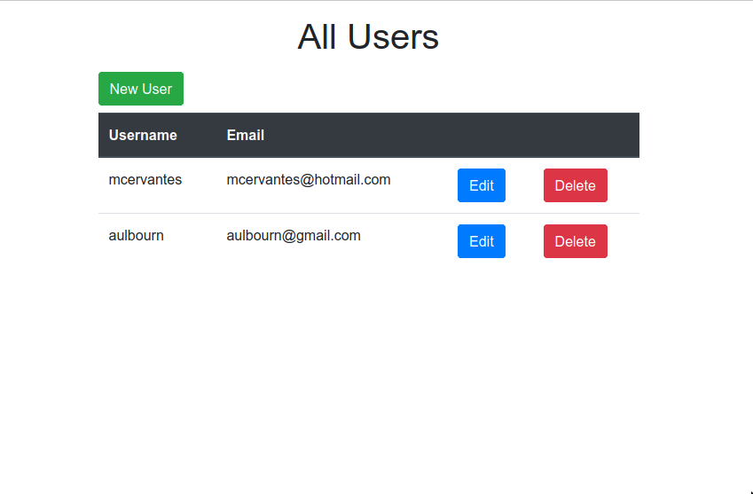

# Forms

In this project we built a rails form from the ground up that sends parameters to a controller that builds an instance of a model with the parameters.

## :package: Built With

    - Ruby
    - Ruby on Rails
    - Heroku

## :mag: Live Demo

[Live Demo Link](https://vast-temple-16115.herokuapp.com/)

## :busts_in_silhouette: Authors

👤 **Martin Cervantes**

- Linkedin: [Martin Cervantes](https://www.linkedin.com/in/cervantesmartin/)
- Twitter: [@M4rt1nC3rv4nt3s](https://twitter.com/M4rt1nC3rv4nt3s)
- Github: [@mcervantes71](https://github.com/mcervantes71)
- Gmail: [cervantes.martine](mailto:cervantes.martine@gmail.com)

👤 **Aulbourn Knowles**

- Linkedin: [Aulbourn Knowles](https://www.linkedin.com/in/aulbourn-knowles)
- Twitter: [@aulbytj](https://twitter.com/aulbytj)
- Github: [@aulbytj](https://github.com/aulbytj)
- Gmail: [aulbourn](mailto:aulbourn@gmail.com)

## 🤝 Contributing

    Contributions, issues and feature requests are welcome!

Feel free to check the [issues page](https://github.com/mcervantes71/Re-Former/issues).

## :star2: Show your support

    Give a ⭐️ if you like this project!

## 📝 License

This project is [MIT](lic.url) licensed.
